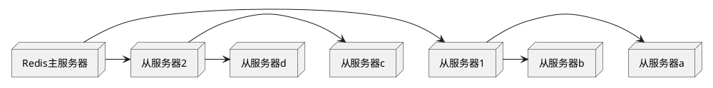

# redis cases

## redis 排序

https://redis.io/commands/sort

## redis 持久化

### 快照持久化

__快照持久化只适用于那些即使丢失一部分数据也不会造成问题的应用程序。__

```conf
# snapshotting config
save 60 1000
stop-writes-on-bgsave-error no
rdbcompression yes
dbfilename dump.rdb
```

可以通过`bgsave` & `save` 手动创建快照。

`bgsave`通过子进程的方式备份数据。因此当数据量较大时创建子进程会花费大量时间，并会导致redis出现停顿。

使用`save`备份数据时会一直阻塞redis直到快照生成完成。但`save`不需要创建子进程，不会造成redis停顿，并且没有子进程争夺资源，所以`save`相比`bgsave`更快一些。

对于一些场景，可以考虑关闭自动保持，采用定时任务通过`save`手动备份数据。

### AOF持久化

__AOF持久化的原理是将被执行的写命令写入AOF文件的末尾，以此来记录数据发送的变化。__

```conf
appendonly no
appendfsync everysec/always/no
no-appendfsync-on-rewrite no
auto-aof-rewrite-precentage 100
auto-aof-rewrite-min-size 64mb

dir ./ # 决定快照文件与AOF文件的保持位置
```

推荐采用`appendfsync everysec`，redis以每秒一次的频率对AOF文件进行同步。每秒一次的同步频率对redis的性能影响不大，而且即使出现系统崩溃，用户也至多丢失一秒的数据。

这也导致了AOF的缺陷，__AOF备份文件会无限增大__。AOF的无限增大可能会耗尽系统所有的磁盘空间。此外当redis重启后需要重新执行AOF记录的所有写命令来还原数据，如果AOF文件过大，还原操作的执行时间就会很长。

`BGREWRITEAOF`命令能通过重写AOF文件，消除文件中的冗余命令，进而减少AOF文件的体积。

`auto-aof-rewrite-precentage`和`auto-aof-rewrite-min-size`的含义。

举个例子，假如redis设置了`auto-aof-rewrite-precentage 100`和`auto-aof-rewrite-min-size 64mb`，并且开启了AOF持久化，那么当AOF文件的体积大于64MB，并且AOF的文件体积比上次重写之后增大了一倍（100%）时，redis将执行`BGREWRITEAOF`命令。如果AOF重写过于频繁，用户可以考虑将`auto-aof-rewrite-precetage`设置到100以上。

### 文件复制

#### redis主从服务器配置

当从服务器连接到主服务器时，主服务器会执行`BGSAVE`操作，因此需要主服务器提前正确地配置快照。

启动redis服务器是，如果配置文件包含`slaveof host port`选项，则该服务器就会通过给定的host和port连接主数据库。对于运行中的redis服务器，可通过`SLAVEOF no one`终止复制操作，不在接受主服务器的数据更新。可通过`SLAVEOF host port`命令让一个服务器开始复制一个新的服务器。

__从服务器进行数据同步时，会清空自己所有的数据。__ 从服务与主服务器初始连接时，数据库中所有的数据都会丢失，并被替换为主服务器发来的数据。

__redis不支持主主复制（master-master replication）。__

#### 主从链

__从服务器也可拥有从服务器。__

从服务器对从服务器进行复制在操作上与主服务器对从服务器进行复制的 __唯一区别__ 是，如果从服务器X拥有从服务器Y，当X从其主服务器获取快照文件并解析时，会断开与从服务区Y的连接，导致从服务器需要重新连接并重写同步。

当读请求的重要性明显高于写请求时，并且读请求的数量远远超出一台redis服务器可以处理的范围时，用户需要增加新的从服务器来处理读请求。但随着负载不断上升，主服务器可能无法快速的更新所有的从服务器，或者因为重新连接和重新同步从服务器而导致系统超载。

为了缓解这个问题，可以创建由redis主从节点组成的中间层来分担主服务区的复制工作。



#### 检查硬盘写入

通过检查`aof_pending_bio_fsync`是否为0。

```py
# 执行写入操作后检测数据是否写入硬盘。
def wait_for_sync(mconn, sconn):
    identifier = str(uuid.uuid4())
    mconn.zadd('sync:wait', identifier, time.time())

    while not sconn.info()['master_link_status'] != 'up':
        time.sleep(0.001)

    while not sconn.zscore('sync:wait', identifier):
        time.sleep(0.001)

    deadline = time.time() + 1.01
    while time.time() < deadline:
        if sconn.info()['aof_pending_bio_fsync'] == 0:
            break
        time.sleep(0.001)

    mconn.zrem('sync:wait', identifier)
    mconn.zremrangebyscore('sync:wait', 0, time.time()-900)
```

### 处理系统故障

#### 验证快照文件和AOF文件

`redis-check-aof`和`redis-check-dump`。

当运行`redis-check-aof`程序时给定`--fix`参数，程序会对AOF文件尽心修复。修复AOF文件的方法十分简单：扫描给定的AOF文件，寻找不正确或是不完整的命令，当发现第一个出错的命令时，删除出错的命令以及出错命令后的所有命令。

__对于出错的快照文件，目前无法没有办法可以修复。__ 因为快照文件经过压缩，对出错的命令进行修复，可能导致快照剩余部分无法被读取。所以需要对快照文件保持多个备份。

#### 更换故障主服务器

假设A、B两台服务器都运行着redis，其中机器A为主服务器，机器B为从服务器。当A出现故障断开网络后，需要新的主服务器C时。

有两种方法：

1. 先向机器B发送一个`SAVE`命令，创建一个新的快照文件，接着将快照文件发送给C，并在机器C上启动Redis。最后将机器B成为机器C的从服务器。

2. 将从服务器升级为主服务器，并为升级后的主服务器配置从服务器。

Redis sentinel: 监视指定的Redis的主服务器和其下属的从服务器，并在主服务器下线时自动进行故障转移。

## redis分片

### 如何写出合理的分片键函数？
